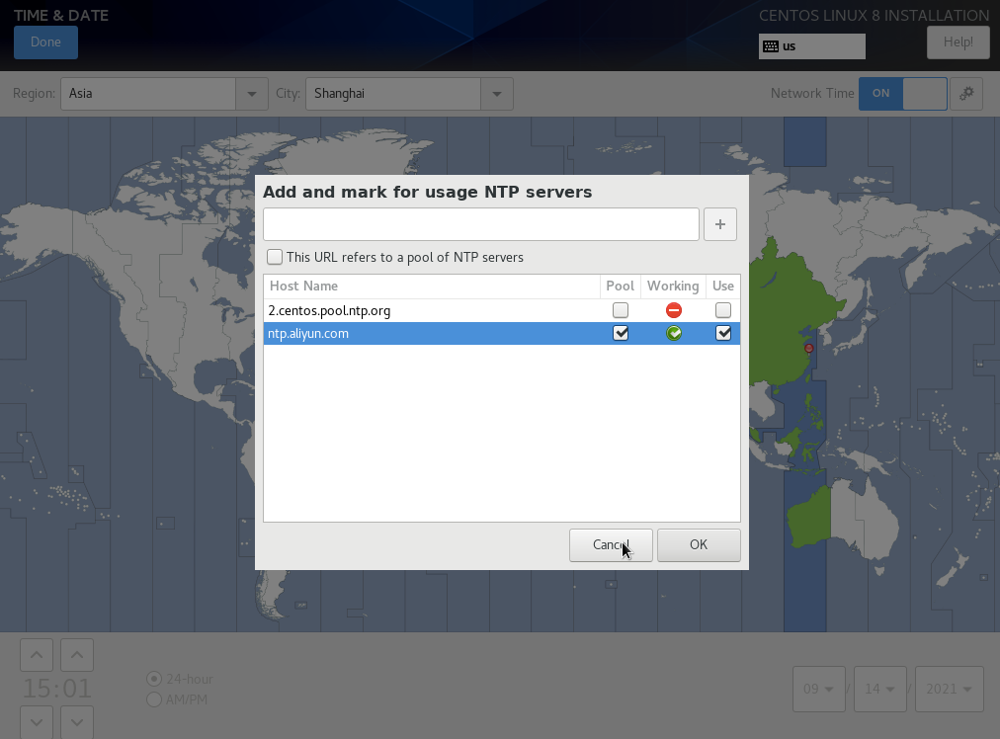
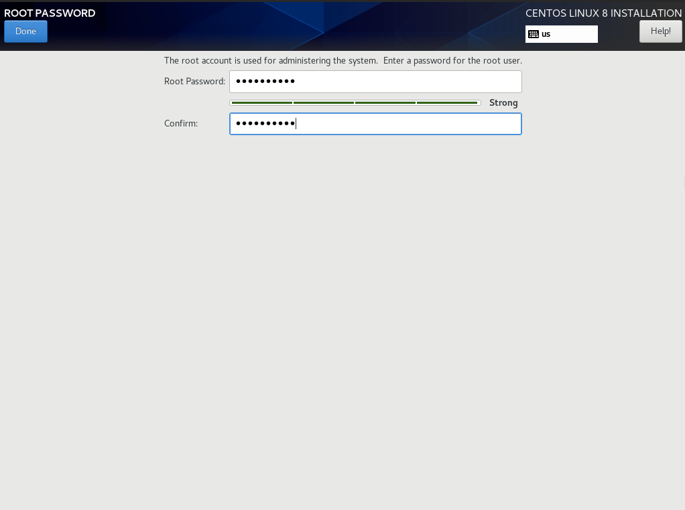
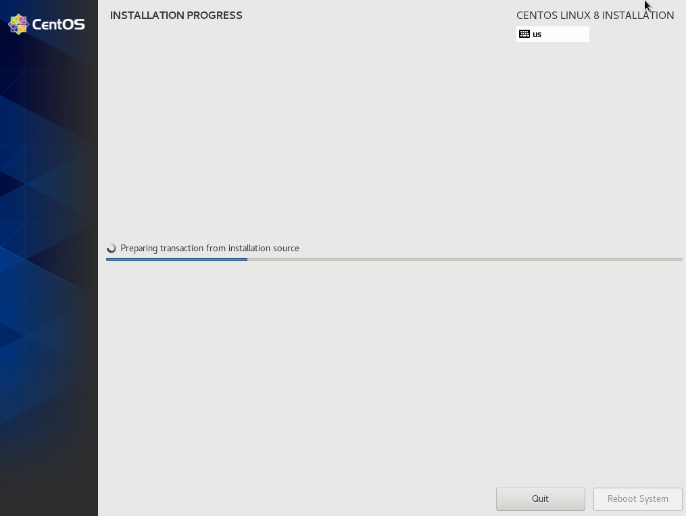

# install centos 8 by boot image

## purpose

* install centos 8

## pre-requirements

* a machine with x86_64 cpu
* you can use qemu to virtualize a machine
    + [install with linux](qemu/install.with.linux.md)
    + [install with mac](qemu/install.with.mac.md)

## do it

1. choose installation language: "English" -> "English(United States)"
    + 
    + 
2. keep Keyboard as "English(US)"
3. configure network and hostname
    + turn network on
    + set hostname to "node-01"
    + 
4. set time&date:
    + turn network time on
    + open configuration page and add "ntp.aliyun.com" as ntp servers if origin one cannot connect to
    + set "Region" to "Asia" and "City" to "Shanghai"
    + 
5. keep installation source not changed(will be updated after network connected)
6. choose local disk as "Installation Destination"
    + 
7. in "Software Selection"
    + choose "Minimal Install"
    + do not add any additional software
    + 
8. set root password
    + 
9. settings finished state: confirm and click "Begin Installation"
    + 
10. waiting for installation to be finished
    + just click "Reboot System"
    + 
11. login and check
